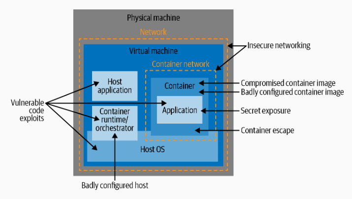
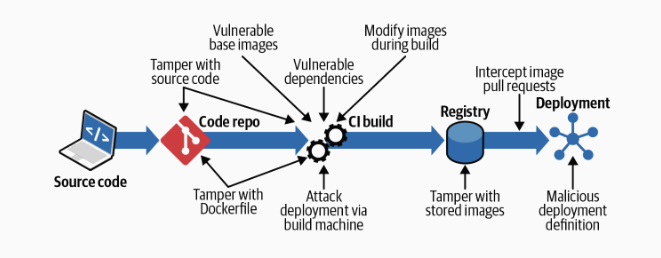
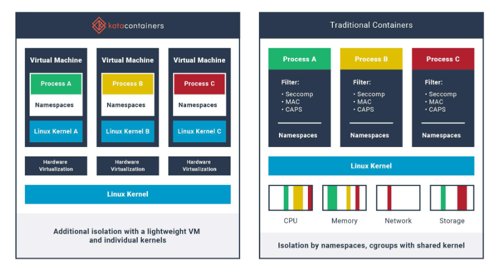
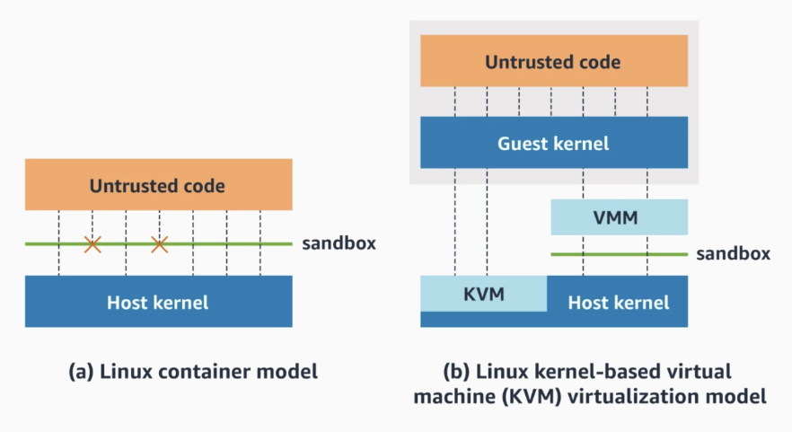
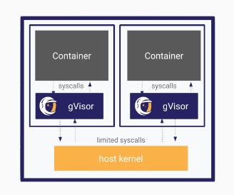
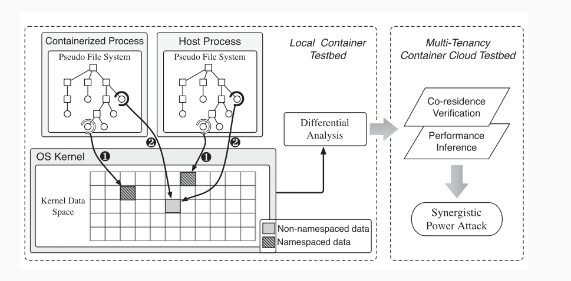

# Lecture 10/5/24

# Topic: Docker security

Actors:

- external and internal attackers
- malicious internal actors
- incompetent internal actors
- automatic processes: CI (continuos integration), ecc...

Attack Routes:

- credentials
- system permissions
- network access
  
Attack Vectors



> Attack vectors can be chained
>
> Remote code Execution in a container with useless data which is badly configured can lead to host access

Common attack tactics and techniques is the _MITRE ATT&CK_ knowledge base. It exists a MITRE ATT&CK container matrix.

## Security principles

- Least privileges
- Defense in depth
  - apply many layers of protection
- Reduce attack surface
- Limit blast radius
  - limit the impact of a breach to a module
- Separation of duties
  - a mix of least privilege and limit blast radius

In practice in container we should:

- Least privilege
  - minimize privileges to containers based on their function
- Defense in depth
  - use Linux tools and components (ex: namespaces and AppArmor) to provide multiple layers of defense
- Reduce the attack surface
  - split monoliths into simple cloud-native apps
- Limit blast radius
  - if container is compromised, security controls should avoid affecting the rest of the system
- Segregation of duties
  - pass auth only to container that needs them

## Image Security

Attacks possibile:

- Build time
- Stored
- Deployment stage




### Build time

Secure:

- docker file
  - check where the file is from
- build machine
  - access control to machine
  - strip down the machine only to what is necessary
  - production env should be separated
  - remember that te build tool(docker daemon) is root
  
Best practices:

- base image
  - pull images from trusted registry
  - use small images
    - small attack surface
- multi stage builds (use multiple FROM)
  - each from can use a different base
    - each from begins a new stage of the build
  - copy artifacts from one stage to another
    - leave behind everything not needed
- non-root user
  - USER instruction specifies user identity for the image
- RUN commands
  - generally dangerous
  - it runs any code on your machine 
  - audit log for RUN commands
- Volume mounts
  - do not mount sensitive data, ex: `/bin`
- No secrets in Dockerfile
- avoid setup binaries
  - they run as root
- Include everything
  - avoid container installing packages at run time

### Image storage

Best practices:

- Secure registry
  - run your own registry to have full control
- Sign images
- Deploy correct image
  - tags are mutable
  - use the digest(hash) which is immutable
- admission control
  - check if an image has been scanned
  - it's a mix of all of the above

> Vulnerabilities
> 
> - flaw that can be exploited by a malicious actor
> - CVE (Common Vulnerabilities and Exposures)
>   - each vulnerability gets a unique identifier
> - NVD (National Vulnerability Database)

- Scanning
  - scan container for vulnerable software
  - easier than scanning running containers

### Immutable containers

Past: containers updated without rebuilding them

problems:

- reproducibility issues
  - different instances may run different software versions
- cleaning
  - you can forget to remove stuff which is not needed anymore

Now:

- tools to enforce immutability
- container with read-only filesystem

### Image scanning

Docker Trusted Registry

Outcome of the scan depends on many factors. False positives are a thing.

Scanning factors:

- source of info
  - do not rely only on NVD, check also security feed from distros and other sources
- do not fix
  - sometimes some things are not fixed on purpose
  - how should we consider this things when scanning
- additional scanning features
  - bad configs
  - embedded secrets

Scanning: as early as possibile

- on local machine before pushing to repo
- scan when building (CI)
- scan images on the registry

## Container isolation

### Seccomp

unused system calls are attack surface. Seccomp can restrict the system calls that a process can make. it is now integrated in the linux kernel.

- seccomp-bpf
  - uses a profile that indicates what to do when a syscall matches a given filter
  - actions are matched in priority order
  - ex of actions: _kill the process_ -> ... -> _log_ -> _allow_
  - filtering needs matching and this implies a cost

Docker seccomp profile blocks more than 40 syscalls.

Docker gives you a good default but the best thing to do should be tracing your specific application and create a custom filter.

Software debloating is in general a good thing to do.

Research pills: create multiple fitlers. One for each stage of the application.
Ex: Nginx:

- Initialization state
- Serving state

### LSM Linux Security Modules

MAC: Mandatory Access Control system

MAC is a policy-based framework that establishes and enforces rules for users and processes when it comes to accessing files, directories, ports, and other resources

AppArmor and SELInux are systems to restrict capabilities. They are very comparable.
AppArmor is easier to use but a little less capable than SELinux

#### Linux capabilities

- Unix has 2 categories of processes
  - privileged processes aka `root, ID = 0`
  - unprivileged processes aka `ID != 0`
- privileged processes bypass all kernel permission checks
- capabilities
  - root user privileges divided into distinct units called capabilities
  - can be enabled and disable independently
  - each thread has its own capabilities
- Linux has more than 30 capabilities
  - ex: `CAP_SYS_BOOT` the thread can reboot the system

### AppArmor

profiles are based on paths

Profile associated to an executable file determines what that file is allowed to do.

```apparmor
/usr/bin/firefox {
    # profile contents
}
```

### SELinux

Security-Enhanced Linux

based on labels.

Constrains how a process can interact with files and processes

- Every file must be labeled by SELinux before policies can be enforced
  - each process runs under a SELinux domain
  - policy express the permissions of a process to files
- limits the files a process can affect if compromised.

### Sandboxing

- Kata Containers
  - container runtime made with lightweight VMS
  - should perform like docker but provide stronger isolation
  - \---
  - 
- Firecracker
  - minimal VMM
  - uses KVM (Kernel-based Virtual Machine)
  - manages micro VMs
  - \---
  - 
- gVisor
  - application layer kernel
  - implements a portion of Linux system call interface
    - paravirtualisation
  - provides additional layer of isolation between applications and host
  - \---
  - 
- Unikernels
  - standalone stripped down OS
  - every application has to be compiled int a Unikernel image with everything it needs
  - difficult to manage

#### Price for sandboxing

- Startup time
  - some seconds
- Performance
  - some seconds
- I/O
  - not drastic but considerable

result: performance degradation is not that bad

### Breaking container isolation

#### Containers run as root by default

- when we start a container as non root insider the container we are root.
- root inside the container is the same root on the host
- if you escape the container you are free to do whatever you want on the host

Examples:

nginx is a webserver designed to run directly on the serve. it uses the port 80 and so you need to be root

Solution:

- `--user` option overrides the user config
  - `docker run -it --rm --user 5000 alpine sh`
- nginx
  - map a random port outside the container to port 80 inside the container

#### `--privilege` flag

Adds capabilities to the container. It saw introduced to run docker inside docker. It's used in CI. use it only if needed.

#### Mounting sensitive directories

`docker run -it -v /:/hostroot alpine sh`

- `/root`
  - ... ( 0 _ 0 )
- `/bin`
  - can modify executables
- `log dir`
  - can remove proof of the attack

#### Mounting Docker Socket

Bad practice.

When you run a command you send instructions trough docker socket to docker daemon

Jenkins can mount the socket to run image builds in the pipeline.

An attacker trough the Jenkins file can run docker commands.

#### Sharing namespace between container and host

if we run a container with `--pid=host` we break the container isolation.
we can see all the processes and even kill them.

### Research pills

container leakage channels:

- infer prive data of other containers on the same machine
- detect and verify co-residence
- cover channels
  - memory usage can be one

some files can leak informations on host or containers especially if containers are not properly namespaced.



## Passing secret to containers

Secret properties:

- accessible only to who are supposed to have access
- stored securely
  - encryption
  - unencrypted version only in memory
- revoke secrets
- rotate or change secrets

Passing a secret

bad: embedded in container images. docker layers do not forget

secure ways:

- through the network
  - difficult to implement
- prive them at startup time
- read it from a file in a mounted volume
  - most used option
- secrets management system

## Container runtime

containers should be small applications(simple behavior). Easy to profile, ex: should it access other containers?

- Profile the container
  - control it at runtime to see if it deviates from the expected behavior
  - monitoring, anomaly detection

This is done to detect a change due to a compromised container.
