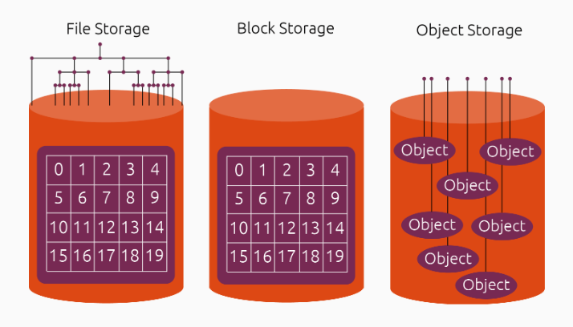
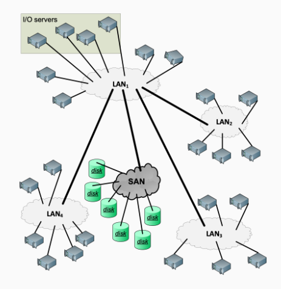
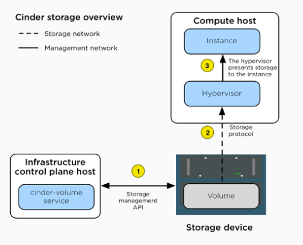
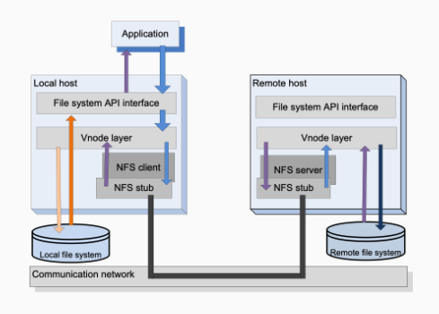
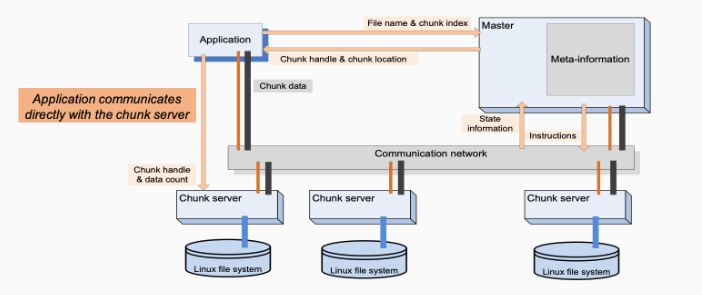
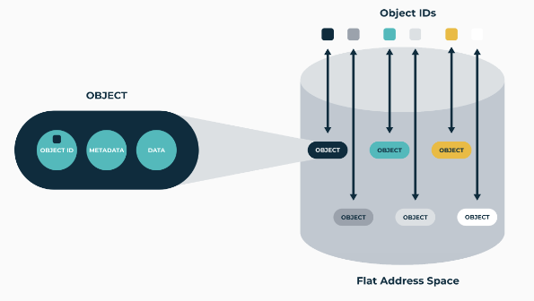
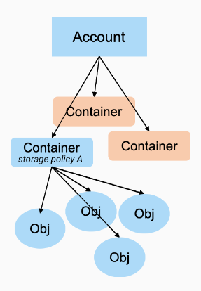
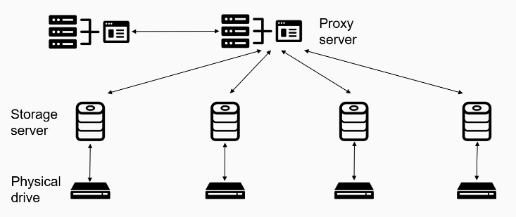
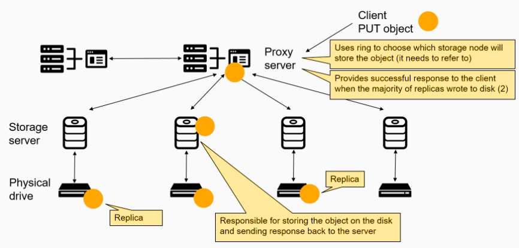
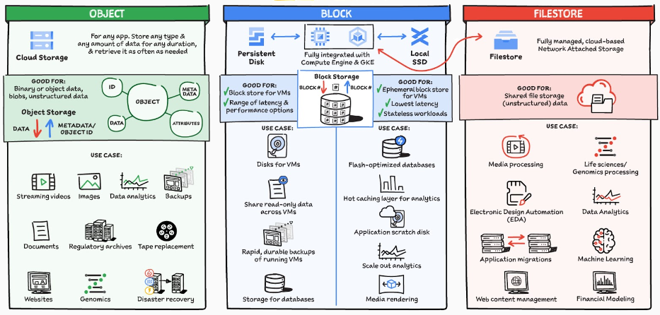

# Lecture 24/5/24

# Topic: Cloud Storage

## Types

### Block storage

- Data stored in fixed-size blocks. 
- It's raw and fast. 
- It's the foundation of the other storage solutions

### File storage

- Data is stored as structured files. 
- It uses a file system that controls how data is stored and retrieved. 
- file system can be local or distributed.
  - local: `ext4`
  - distributed: `NFS`(Network File System)

### Object storage

- Different paradigm. 
- Object: collection of data and its metadata.
- no hierarchy.
- fast access to objects

## Block storage

### 2024

Why do we still need block storage ?

Because other storage types are built on top of it.

Block storage is usually used in Storage Area Networks (SAN).

A SAN is a network that connects storage devices.

### OpenStack Cinder

Block storage service

- abstract the storage technology
- virtualize the management
- unified API to attach storage to VMs

## File storage

A file is a logical thing. It's not guaranteed that the file is continuos in memory. The file system connects the logical and real view.

file system:

- logical, hierarchical view of the files
- provides mechanism for accessing the files
- local or distributed

### File system types

#### Local file systems

Run on single machine

#### Distributed file systems

Manage resources across different machines

- fault-tolerance
- store access sharing
- concurrent fast access

##### NFS Network File System

Provides file system access over a network

- based on the client-server paradigm
- caching to improve performance

Flow

- To retrieve a file, the client interacts with the local vnode layer
- The vnode layer then sends the request via the NFS client
- The server passes it to the vnode layer on the remote host
- Finally, the remote vnode layer directs it to the remote file system

Cons:

- cache
  - size
  - location
  - writing policy
  - synchronization
- consistency

##### GPFS General Parallel File System

Focus on concurrency control.
Supports parallel I/O operations.

How it works:

- write-ahead log file
  - fast crash recovery
    - on crash I check the data on the disk against the log and if the two are not consistent I make corrections
- data striping (striping segments data on different physical storage device)
  - 2 minimum replicas to guarantee consistency

##### GFS Google File System

Key features:

- scalability and reliability
- relaxed consistency model
- bulk processing of large files in parallel

Key assumptions:

- reads are large and sequential or small and random
- write are sequential and append only (log file is an example) from multiple clients
- commodity hardware continuously fails
- high bandwidth is more important than real-time

###### How it works 

- files segmented in large chunks (64MB)
  - reduces chunk location requests and metadata
  - improve performance on large files
  - more continuous network location to server location
- chunks are replicated on a minimum of 3 servers
- no cache at all. not in the client and not on the server.
  - the necessary bookkeeping is not worth it

**Master**

- in charge of the cluster state
  - manages consistency and critical operations
- great difference between control plane and data plane

> **thick lines** are data
> _thin lines_ are control

Write request example:

- Client contacts the master, which assigns a lease to one of the chunk servers (no lease for that chunk exists)
  - Master replies with the ID of the primary and secondary chunk servers holding replicas of the chunk
- Client sends data to all chunk servers holding replicas
  - Chunk servers stores data in internal LRU (Least Recently Used) buffer and send ACK to client
- Client send write request to primary chunk server once it got ACKs from all chunk servers holding replicas
- Primary chunk server sends write to all secondaries
- Each secondary applies mutations in the order of the sequence number and sends ACK back to primary
- After receiving ACK from all secondaries, primary ACKs client

## Object Storage

More flexible storage models which is a mix of the above

We can call it **software defined storage** because every vendor has his own flavor

### OpenStack Swift

- scalability
- multi-user
- high-concurrency
- ideal for unstructured data that grows without bound

Selling points:

- horizontal scaling
- fault-tolerant and self-healing
- easy to manage
  - thanks to REST API
- agnostic to what is stored

#### Hierarchy

- -> Account
  - user account
  - your account is the level in the hierarchy of your files
  - -> Containers
    - namespace for objects (folder)
    - ACL to access object
      - ACL for objects is associated to the container and not to the individual object
    - storage policy: defines how data is stored
      - ex: a container should use only ssd
      - applied at container level
    - -> Object
      - Stores data content
      - Uncompressed and unencrypted

- Ring
  - mapping data and storage location
    - uses hash to perform the mapping to a particular location
    - combines:
      - account
      - container
      - policy

#### Architecture

Servers:

- Proxy server
  - front-end of the swift architecture
  - API endpoint
- Storage server
  - object server
    - manages objects stored on local devices
  - Container server
    - lists objects
    - it only knows in which container the objects are
  - Account server
    - list containers
- Consistency server
  - Replicator server
    - ensures all replicas are in sync
  - Updater server
    - Manages the replication process
    - handles congestions and failures
  - Auditors
    - craws local server checking integrity
    - replace corrupted files with healthy backups

Operation example: PUT

## Recap

> GCPSketchnote
> thecloudgirl.dev