# Lecture 29/5/24

## Topic: Cloud Storage (1 hour)

## Distributed databases

Store and query structured data across multiple machines

> structured data: data organized in a specific way
>
> - files are unstructured data
> - records in a SQL database are structured data

Database models:

- Relational databases
  - table structure
  - SQL query language
- Object oriented databases
  - now dead
- NoSQL databases
  - now more like not only SQL

### Database properties

#### ACID

- Atomicity
  - transactions are treated as single unit
    - complete success
    - complete fail
- Consistency
  - transactions move the DB from one consistent state to another
- Isolation
  - we execute each transaction independently as they were sequential
- Durability
  - when a transaction is committed it is permanent
  - completed transactions are written to disk

In classical databases data is stored in a single location

- no worries about consistency
- ACID properties are easy to guarantee

ACID is not applicable when network is involved

#### BASE

- Basically Available
  - consistency is sacrificed for availability
  - we prefer to serve queries over consistency of the system
- Soft state
  - data is allowed to be out of sync for a short period of time
- Eventually consistent
  - after a write is performed at a certain point the system will converge
  - meanwhile reads could return old values
  - we take this risk (calculated risk backed by papers)

BASE is not enough and so we introduce Locks and consensus

#### Locks and consensus

- Locks
  - they ensure atomicity when performing reads and writes
    - a lock can be a file
  - ex: student taking a seat in the library
- Consensus
  - mechanism to ensure that all nodes agree on the same state
  - ex: friends deciding where to go for dinner

### CAP theorem

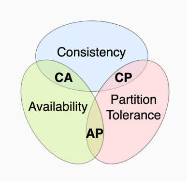

Distributed systems cannot guarantee all properties

- consistency
- availability
- partition tolerance
  - nodes can be cut off from other for any reason
  - ex: master in bolzano get cut out from nodes in trento

### Google Bigtable GBT

Distributed storage system for structured data

Data is stored using the GFS

- sparse (sparse matrix)
- distributed
- multi-dimensional sorted map
  - key-value store

#### Table

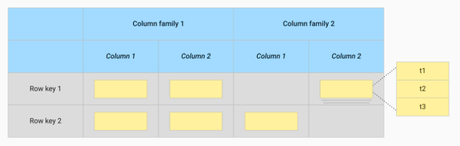

- row identified by unique key
- columns grouped in families with unique names
- cells have timeline properties
  - multiple values on the same cell with an history
- tables are sparse
  - we can have empty field
  - no need for `NULL` value
- tables are "infinite"

#### Tablet

We split tables into tablets

Tablets are a collection of a continuos range of rows. They are distributed and replicated.

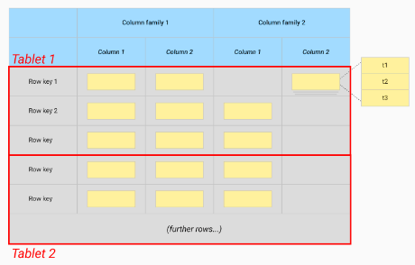

---

##### Sorted String Table SST

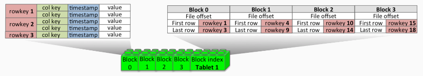

- each tablet is a sequence of blocks
  - 1st block is the index
    - map key -> block index
- each block store the actual data for a range of keys

---

##### Special tablets

Tablets need to be localized inside the cluster and to achieve this we use special tablets.

- ROOT tablet
  - contains the location of the metadata tablets
- METADATA tablet
  - contains the location of all other tablets

Hierarchy of tablets to find all the tablet like a tree

ROOT -> METADATA -> tablets

- COMMIT LOG tablets
 - store uncommitted transactions

#### Tablet servers

Stateless servers that manages tablets

Each tablet is assigned to one server at time

- manage read and write
- split tablets
- stateless

Clients communicate with the master tablet server to access data.

On startup a tablet server acquires a lock so it can be discovered by the master

##### Master tablet server

manage the cluster

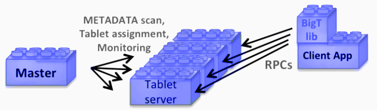

- tracks
  - live tablets
  - unassigned tablets
    - assign tablet to a server that can handle it
- detects problematic server checking their locks
  - if the server do not respond or report a dead lock the master tries to take te lock himself
    - success
      - the server is dead
      - the tablets are reassigned
      - the malfunctioning server is killed
    - fail
      - chubby has crashed and the master kills itself to avoid split brain scenarios

---

#### Chubby

Distribute lock service

chubby ensures that there is only one master at a time

---

#### GBT Architecture

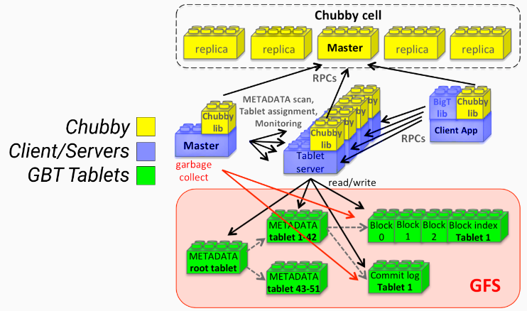

#### GBT DNS-like tablet location

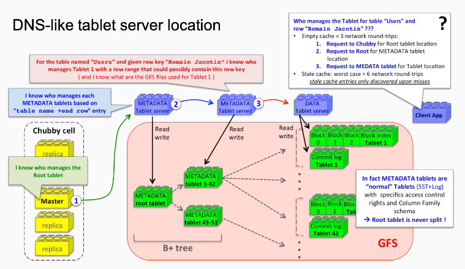

dns like tablet retrieve

- contact tablet server
- find root tablet
- go to metadata tablet
- go to tablet

#### Master startup and locks

Master start procedure

- grab unique master lock
- scans server directory in chubby to find tablet servers
- retrieve assigned tablets from servers
- checks root table assignment
- scan metadata tables to detect unassigned tables

#### Tablet merging and splitting

- master server -> merging
- tablet server -> splitting
  - commit the split by writing information of the new tablet in the relative metadata tablet
  - tablet server notifies the master after split

#### Tablet serving

##### Write

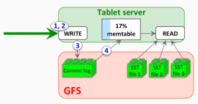

- check request form and authorization
- write ahead commit log
- operation is written to a memtable

memtable: table but in RAM memory instead of GFS

##### Read

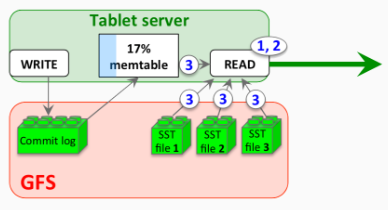

- check request form and authorization
- read operation is executed from both the memtable and the SST

we perform a merge read because in memory we could have newer informations

##### Recovery

When a tablet server crashes the commit log is read and the memtable is recreated by following the commit log

##### Compactions

###### Minor

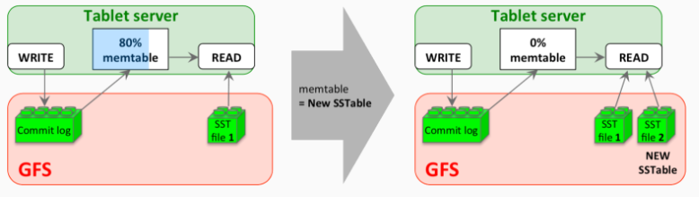

- when the memtable is too big it is converted to SST and written to GFS

###### Merging

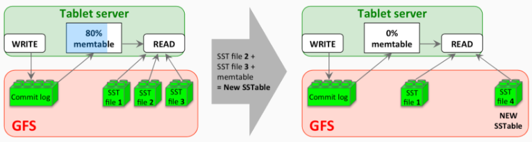

continuos minor compaction create infinite SST

- periodic merging of SST

###### Major

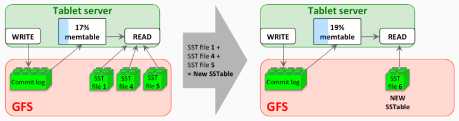

SST become sparse as records fragment more and more

- merge all the SST into one SST
- defragmentation