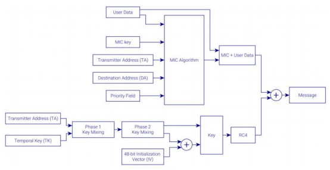
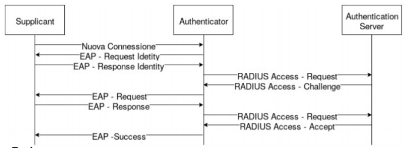

# Sicurezza in IEEE 802.11

Per sua natura, il WiFi ha problemi come

* Intercettazione Dati\
  Le onde radio non possono dirette a un singolo dispositivo in modo completamente sicuro, chiunque sia nel raggio può leggere
* Intrusione di Rete\
  Un access point non richiede vicinanza fisica allo switch/altri dispositivi intermediari, una rete wireless di conseguenza risulta un entrypoint adatto per chi voglia entrare in una rete senza essere notato. Una rete wireless quindi richiede maggiore attenzione alla sicurezza, soprattutto perché in Italia l'azienda che installa la rete è ritenuta responsabile dell'attacco se non può dimostrare che ha fatto il possibile per evitarlo
* Disturbo Radio\
  Le onde radio sono molto sensibili alle interferenze, quindi un attacco Denial of Service (Diverso da DoS e DDoS, attenti che poi mi date la colpa) è semplice da effettuare, così come sono semplici da costruire i Radio Jammers (dispositivi che riempiono la banda di disturbi)

Gli obbiettivi della sicurezza sono sempre gli stessi

* Riservatezza\
  Il destinatario/I destinatari dev'essere l'unico in grado di leggere il messaggio
* Integrità\
  Un messaggio alterato non deve risultare valido al destinatario (e possibilmente a qualsiasi nodo che lo legga)
* Disponibilità\
  Chi è autorizzato dev'essere in grado sempre di accedere alla rete senza particolari problemi

Inoltre qua abbiamo

* Controllo\
  Dev'essere possibile autorizzare un client solo entro un certo limite di tempo e dev'essere possibile fare le bestie di satana - scusate, intendevo dev'essere possibile loggare le destinazioni dei pacchetti e le eventuali risorse utilizzate in modo che le autorità possano avere una prova di come è stata utilizzata una rete e da chi
* Tutela\
  È necessario poter limitare la navigazione in modo che una rete non possa essere sfruttata in modo sbagliato da malfattori mascalzoni pazzi sgravati

## Alcune Opzioni

* Disattivare il Broadcast dell'SSID, in questo modo un AP/altra stazione non risponderà alle Probe Requests e non manderà informazioni riguardo se stessa per evitare il wardriving, l'unico modo per collegare dispositivi sarà aggiungere la rete manualmente nei dispositivi.
* Filtrare i MAC addresses delle schede di rete in modo da permettere l'accesso solo da dispositivi autorizzati. Non è una soluzione che garantisce sicurezza assoluta, in quanto è semplice agire in una rete come se il MAC fosse uno diverso, quindi è facilissimo agire come se si fosse autorizzati quando si conosce uno dei MAC corretti.\
  Inoltre sono 48 bit, che da brute forceare non sono moltissimi, soprattutto perché parte di quell'indirizzo identifica la compagnia che ha fatto la scheda di rete e quindi si può assumere che quella parte di indirizzo cambi molto meno spesso e sia praticamente di pubblico dominio.\
  Inoltre oggi, per sicurezza e anonimità, solitamente il MAC viene randomizzato prima di connettersi a una rete, disattivare questa funzione solo perché una rete ha MAC Filtering attivato significa perdere l'anonimità
* Utilizzare un protocollo adeguato per la cifratura

##### Wardriving

Pratica illegale che consiste nel girare in automobile o a piedi con un antenna (spesso omnidirezionale) per cercare reti per poi pubblicarne la locazione geografica online.\
È necessario usare software particolare che permetta il device detecting/wardriving.

# Algoritmi di Sicurezza per IEEE 802.11

## WEP - Wired Equivalent Privacy

Introdotto con l'802.11 e ratificato nel 1997, tenta di fornire un meccanismo di autenticazione e vuole garantire un livello di affidabilità pari alle connessioni cablate

Sfrutta l'RC4 stream cipher per la cifratura (segretezza), un checksum CRC per garantire l'integrità e l'autenticazione è fatta attraverso un challenge-response handshake

#### RC4

cifrario a flusso (stream cipher al posto di block cipher), necessità in input una chiave e genera un keystream (un keystream è un flusso di bytes che va unito al messaggio in plaintext per cifrarlo).\
Nel WEP la chiave è una combinazione di una chiave condivisa (WepKey, di lunghezza variabile, almeno 40 bit) e un Initialization Vector (d'ora in poi nominato IV) di 24 bit.

L'IV viene generato dalla stazione che invia il pacchetto e può essere inviato in chiaro assieme ad esso, è diverso per ogni pacchetto.

#### CRC32

Il messaggio viene suddiviso in blocchi e viene calcolato il CRC a 32 bit di tutti i blocchi.\
Prima della cifratura il blocco e il suo CRC sono concatenati assieme

Per cifrare un messaggio si prende il keystream dall'RC4 e si fa lo xor con lo stream di blocchi e CRC\
Ciphertext = Keystream `xor` (block, CRC32(block))1..n

#### Flow di Autenticazione

Stazione manda Authentication Request, L'entrypoint (comunemente un Access Point, ma potrebbe essere un'altra stazione nelle reti ad-hoc) spedisce indietro una Challenge\
La stazione cifra il testo contenuto nella challenge secondo lo standard e lo manda indietro in una Challenge response, l'entrypoint quindi decifra la risposta alla challenge e confronta il risultato con l'originale, se sono uguali allora anche la WEP key è uguale e quindi l'entrypoint risponde confermando il successo.

#### Falle

* La gestione manuale delle chiavi può essere fallata e lo standard non specifica nessun metodo
* L'IV è in generale molto corto, facile da brute forceare.
* Molte implementazioni consentono il riutilizzo dell'IV, portando a un più semplice attacco.
* Molte implementazioni incrementano di 1 l'IV e lo resettano a 24 zeri quando reinizializzate, portando a poter indovinare l'IV più facilmente
* Il CRC32 è una funzione lineare (quindi `CRC32(x + y) = CRC32(x) + CRC32(y)`), di conseguenza è relativamente semplice modificare un messaggio e computare il conseguente nuovo checksum senza che il destinatario si accorga

## WPA - WiFi Protected Access

Nasce nel 2003 per essere retrocompatibile con l'hardware del WEP (implementare WPA deve richiedere solo modifiche software)

Vengono definite due modalità:

* PSK Mode (WPA-PSK)\
  Non è richiesto un server d'autenticazione, ma viene usata una PSK (Pre-Shared Key, chiave precondivisa), di semplice configurazione in reti private
* Enterprise Mode (WPA-802.1X)\
  Segue il Protocollo Extensible Authentication Protocol (EAP) per l'autenticazione.\
  Richiede un server RADIUS per la distribuzione delle chiavi e l'autenticazioni di nuovi dispositivi (es nuovo dispositivo chiede di accedere, l'entrypoint chiederà al server RADIUS se la coppia nome-password è autorizzata e sarà lui a rispondere affermativamente, negativamente o chiedendo ulteriori informazioni).

Un server separato per l'autenticazione dà molta più flessibilità e sicurezza,\
ad esempio è possibile avere una password diversa per utente, non MAC ma utente, ed è possibile richiedere password secondarie o altri token di sicurezza. Inoltre, la chiave che cifra il traffico non deriva da una chiave precondivisa (come nel WPA-PSK, dove diversi dispositivi possono derivare le chiavi di altri dispositivi connessi alla stessa rete) ma da token diversi per utente/dispositivo.\
('sta cosa nel PDF è spiegata col culo perché fa un sacco di confusione coi termini e sembra abbastanza complessa da approfondire ora).

#### Principali Differenze

* Autenticazione attraverso PSK o framework EAP
* Il protocollo di cifratura TKIP rimpiazza il WEP (ma si basa comunque su RC4 perché l'hardware doveva rimanere lo stesso), il TKIP specifica:
  * un IV è più lungo, da 24 a 48 bit
  * Un nuovo algoritmo per il controllo dell'integrità chiamato Michael che usa chiavi a 64 bit
  * Un sistema per la rigenerazione delle chiavi periodico (non si usa mai la master key ma una key temporale derivata)
  * Una funzione di rimescolamento chiavi per rendere più complicato reversare l'RC4 alla base
  * il keystream RC4 viene ora generato secondo una chiave unica per pacchetto da 128 bit
* La distribuzione delle chiavi è dinamica (la preshared key nel WPA-PSK e le password nel WPA-EAP non vengono usate direttamente ma sono usate in una funzione di derivazione chiavi)
* Un contatore di sequenza dei pacchetti (utilizzato ad esempio per evitare il riutilizzo dello stesso IV)

#### Codifica e Decodifica

Nella decodifica l'IV viene controllato assieme al numero di sequenza per evitare che lo stesso IV o un IV troppo simile sia usato.\
Poi viene confrontato il MIC per verificare l'integrità, in caso i valori non corrispondano, il messaggio viene scartato e viene negoziata una nuova chiave temporanea. L'errore può essere segnalato all'amministratore di rete

## WPA2

Anche qua due modalità per l'autenticazione

* WPA-PSK con Pre-Shared Key
* WPA-Enterprise (anche chiamata WPA-802.1X)\
  Lo standard IEEE 802.1X definisce l'incapsulamento del protocollo EAP sui frame 802.11 (e anche sui frame di altre tecnologie LAN come Ethernet).\
  (il PDF parla di porta virtuale, ma non porta intesa come numero di porta TCP/UDP, è un adattamento del protocollo visto che inizialmente era pensato per ethernet e quindi le porte RJ45. Quello che segue è un riassunto del PDF e non deve essere preso come verità assoluta)\
  Se un utente WiFi viene autenticato attraverso 802.1X, viene aperta una porta virtuale sull'AP/stazione contrassegnata come autenticata e viene permessa la comunicazione\
  Gli attori di di 802.1X sono:
  * Il supplicant, client che fornisce le sue credenziali chiedendo di essere autenticato
  * L'authenticator, fa da tramite tra supplicant e authentication server e consente o rifiuta le connessioni in base alla risposta di quest'ultimo, è un access point/stazione nel WiFi
  * Authentication Server, gestisce le richieste di autenticazione, spesso un server RADIUS (protocollo) che comunica all'authenicator se la porta va segnata come autenticata o meno in base ai record interni

  
