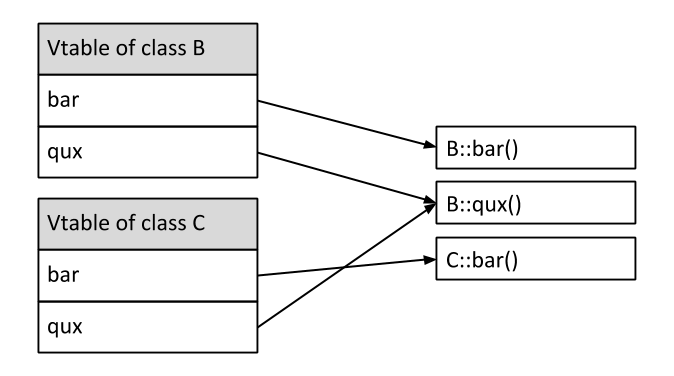
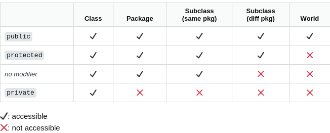
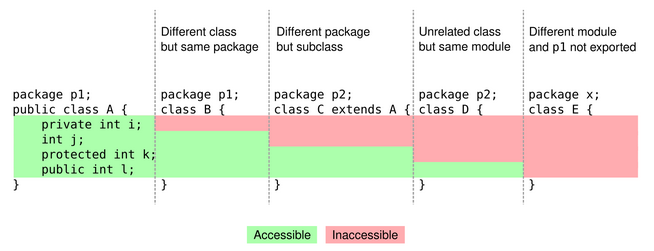

# Java

2021/2022 Ronchetti

_programma perso nel tempo ma simile_

2024/2025 Patrignani

- ereditarietà & final
- abstract & dynamic binding
- modificatori & polimorfismo di sottotipo
- cast & interfacce
- generics & polimorfismo parametrico
- collections
- equals & confronti
- comparable & comparator
- eccezioni
- UML
- JavaFX intro
- JavaFX event propagation
- JavaFx event handlers
- lambda expressions
- clonazione & inheritance vs composition
- MVC pattern

## Index

- [Java](#java)
  - [Index](#index)
  - [Programming languages theory](#programming-languages-theory)
  - [Ereditarietà](#ereditarietà)
    - [`extends`](#extends)
      - [Costruttori](#costruttori)
        - [Costruttore di Default](#costruttore-di-default)
    - [Visibilità](#visibilità)
      - [`public`](#public)
      - [`private`](#private)
      - [`protected`](#protected)
      - [Recap](#recap)
    - [Modificatori](#modificatori)
      - [`this`](#this)
      - [`super`](#super)
      - [`final`](#final)
      - [`static`](#static)
      - [`abstract`](#abstract)
  - [Polimorfismo](#polimorfismo)
    - [Overloading](#overloading)
    - [`@Override`](#override)
  - [Dynamic binding](#dynamic-binding)
    - [Principio di sostituzione di Liskov](#principio-di-sostituzione-di-liskov)
    - [regola per il binding](#regola-per-il-binding)
  - [Casting](#casting)
    - [Upcasting](#upcasting)
    - [Downcasting](#downcasting)
    - [`istanceof`](#istanceof)
  - [Autoboxing](#autoboxing)
  - [Interfacce](#interfacce)
  - [Generics](#generics)
    - [Wildcard](#wildcard)
      - [Esempio](#esempio)
    - [Limitazioni](#limitazioni)
      - [Esempi](#esempi)
  - [Collections](#collections)
    - [Limitazioni](#limitazioni-1)
  - [Uguagliaza tra oggetti: `equals`](#uguagliaza-tra-oggetti-equals)
    - [`equals`](#equals)
      - [`GetClass`](#getclass)
    - [Hash](#hash)
    - [Esempio implementazione di equals](#esempio-implementazione-di-equals)
    - [Warning](#warning)
  - [Comparable \& Comparator](#comparable--comparator)
    - [Comparable](#comparable)
    - [Comparator](#comparator)
  - [Eccezioni](#eccezioni)
    - [Esempio](#esempio-1)
  - [Iteratori](#iteratori)
    - [Warning](#warning-1)
  - [Classi anonime \& Lambda expressions](#classi-anonime--lambda-expressions)
    - [How](#how)
      - [Classe anonima](#classe-anonima)
      - [Lambda](#lambda)
    - [classi anonime vs lambda](#classi-anonime-vs-lambda)
  - [`clone`](#clone)
    - [shallow copy](#shallow-copy)
    - [deep copy](#deep-copy)
    - [`Cloneable`](#cloneable)
    - [Copy constructor](#copy-constructor)
  - [Composition VS Inheritance](#composition-vs-inheritance)
  - [JavaFX](#javafx)
    - [Errore tipico](#errore-tipico)
    - [Propagazione eventi](#propagazione-eventi)
      - [Discesa](#discesa)
      - [Risalita](#risalita)
        - [Consume](#consume)
    - [MVC](#mvc)

## Programming languages theory

Vtable (Virtual Table)

- tabella associata ad ogni classe che contiene puntatori alle locazione di memoria dei metodi
- viene mantenuta in memoria RAM



## Ereditarietà

### `extends`

`Class Cane extends Mammifero {}`

- la sottoclasse eredita tutti gli attributi e tutti i metodi della superclasse
- java non supporta l'eredità multipla
- una classe se non diversamente specificato eredità la classe Object, _radice dell'intera gerarchia_
- Object fornisce alcuni importanti metodi:
  - `equals(Object)`
  - `toString()`

#### Costruttori

non vengono ereditati

- tramite `super` possono chiamare il costruttore della superclasse.
  - deve essere la prima istruzione del costruttore della classe figlia

##### Costruttore di Default

Se nessun costruttore viene definito java crea un costruttore di default

```java
class A {
    int x;

    A() {
        this.x = 0;
    }
}

class B extends A {
    B() { super(); } //il compilatore inserisce questa riga
}
```

Se la classe definisce un costruttore con parametri non può essere creato un costruttore di default

```java
class A {
    int x;

    A(int x) {
        this.x = x;
    }
}

class B extends A {
    // Errore!
}
```

Se il programmatore specifica un costruttore il linguaggio non introduce altro

### Visibilità

#### `public`

- visibile a tutti

#### `private`

- visibile solo all'interno della classe

#### `protected`

- visibile internamente alla classe
- visibile dalle classi
- visibile dalle classi dello stesso packaged

#### Recap





### Modificatori

#### `this`

- per riferirsi all'istanza corrente

#### `super`

- per riferirsi alla superclasse

#### `final`

- definisce una classe, variabile o metodo come non più modificabile
- disattiva il dynamic binding

#### `static`

- modificatore che associa alla classe e non all'oggetto
- valore condiviso tra le istanze
- posso fare riferimento e metodi e valori senza un'istanza
- disattiva il dynamic binding

#### `abstract`

definisce classi o metodi astratti

- un metodo astratto non ha alcuna implementazione.
  - viene implementato dalle sottoclassi
- se un metodo è astratto l'intera classe deve essere astratta
- non è possibile istanziare classi astratte

## Polimorfismo

3 tipi

- polimorfismo di sottotipo
  - tramite ereditarietà
- ad hoc
  - overloading di funzioni
- parametrico
  - generics

### Overloading

- possono esistere più metodi con lo stesso nome e diverse implementazioni che si distinguono per numero e/o tipo di parametri
- il valore di ritorno non permette di distinguere due metodi
  - no overloading sul tipo di ritorno

### `@Override`

consiste nel ridefinire i metodi ereditati della superclasse

- non posso fare l'override ci cose dichiarate final
- non posso fare override di metodi statici
  - posso crearne 2 identici ma sono associati staticamente ognuno alla propria classe
  - viene sempre chiamato guardando il tipo statico

## Dynamic binding

### Principio di sostituzione di Liskov

Se S è un sottotipo di T, allora variabili di tipo T in un programma possono essere sostituite da variabili di tipo S senza alterare alcuna proprietà desiderabile del programma

```java
Point p = new Point(1, 2);
p.move(3, 4);

Point p = new NamedPoint(1, 2, "A");
p.move(3, 4);
```

funziona perchè aggiungo informazioni che al massimo non vengono usate. Rispetto le funzionalità precedenti.

---

- tipo statico
  - deciso a compiletime
  - il compilatore determina la firma del metodo basandosi sempre sul tipo statico
- tipo dinamico
  - deciso a runtime
  - in caso di overriding la specifica implementazione del metodo viene determinata a runtime basandosi sul tipo dinamico
  
### regola per il binding

il metodo scelto dipende dal tipo dinamico e viene deciso a runtime in questo modo:

- Si cerca il metodo all'interno della classe del tipo statico
- Si controlla se il tipo dinamico è una sottoclasse del tipo statico
- Se è un sottotipo si controlla se è definito un override
- Se la risposta è si si utilizza l'implementazione della sottoclasse, altrimenti quella della classe padre

il tipo statico determina quali metodi possono essere invocati. il tipo dinamico determina quale (ri)definizione eseguire

## Casting

conversioni forzata di un tipo

- forza la conversione da un tipo T ad un suo sottotipo T1 se il tipo dinamico é un sottotipo di T1

esistono 2 tipi di casting

### Upcasting

```java
Object o = new AutomobileElettrica(); 
```

- conversione implicita
- regola `is-a`

### Downcasting

```java
Automobile a = o; // ❌ Object non è un sottotipo di Automobile

Automobile a = (Automobile) o; // ✅
```

### `istanceof`

- permette di determinare il tipo dinamico di un oggetto
- posso utilizzarlo per eseguire cast in modo sicuro evitando errori a run-time

## Autoboxing

```java
add(new Integer(3)) -> add(3)
```

- Java implicitamente converte un valore primitivo in un oggetto
- non devo piú preoccuparmi della cosa e posso tranquillamente usare i tipi primitivi

## Interfacce

_ormai sei esperto :) (rust <3)_

- possono essere usate come tipo statico
- non possono essere istanziate

## Generics

- risolvono il problema dei cast espliciti che possono creare errori
- permettono di filtrare quali tipi di oggetti possiamo inserire in una lista
- permettono di creare metodi generici

```java
class Group<T> { ... } //definizione
Group<Student> gs = ... //uso
Group<Tourist> gt = ... //uso
```

### Wildcard

rappresentano un tipo non noto. molto utili nella dichiarazione dei metodi

```java
Group<?> g = new Group<Student>(); // ✅

Group<?> g = new Group<?>(); // ❌ non possono essere usate per creare oggetti
```

posso limitare le wildcard

```java
Group<? extends Persona> g = new Group<Student>(); // ✅

// È possibile specificare più di un tipo: se c’è una classe deve essere la prima
Group<? extends Persona & Comparable> g = new Group<Student>(); // studente implementa Comparable`

// È possibile limitare le wildcard anche verso le superclassi
Group<? super Studente> g = new Group<Persona>(); // ✅
// Studente è superclasse di se stesso
Group<? super Studente> g = new Group<Studente>(); // ✅
```

#### Esempio

```java
public static void printList(List<?> list) {
    for (Object element : list) {
        System.out.println(element);
    }
}

List<String> stringList = List.of("Apple", "Banana", "Orange");
List<Integer> integerList = List.of(1, 2, 3, 4, 5);

printList(stringList);
printList(integerList);
```

### Limitazioni

I generics in Java sono implementati mediante type erasure

- L’informazione sui parametri tipo viene eliminata dopo i controlli statici
- Vengono inseriti gli opportuni cast (il compilatore fa i cast per noi) per mantenere i vincoli sul tipo
- Questa scelta mantiene compatibilità con API che non usano generics
  - ma genera una serie di limitazioni

#### Esempi

- non posso assegnare ad una lista di tipo padre una di tipo figlio
- un gruppo di studenti non é sottoclasse di un gruppo di persone

```java
T[] array = new T[10] // ❌

List<int> = new List<>(); // ❌ non posso usare tipi primitivi
List<int> = new List<Integer>(); // ✅

instanceof // ❌ la type erasure rende inutile instanceof
Object obj = new LinkedList<Long>();
obj instanceof List //true
obj instanceof List<?> //true
obj instanceof List<Long> //error
obj instanceof List<? extends Number> //error
obj instanceof List<? super Number> //error
```

tantissimi altri casi particolari... [approfondimento sui generics in java](http://www.angelikalanger.com/GenericsFAQ/JavaGenericsFAQ.html)

## Collections

Java Collection Framework
- interfacce
- implementazioni
- algoritmi

Collections

- list
- queue
  - deque
- map
  - sortedmap

Operations

- add
- remove.
- bulk operations
  - addAll
  - removeAll
  - toArray()

### Limitazioni

Nascono ancora prima di aggiungere i generics quindi sono abbastanza rotte. I problemi sono i soliti dovuti alla type erasure.

## Uguagliaza tra oggetti: `equals`

quando confronto due oggetti con l'operatore `==` confronto gli indirizzi. quindi il risultato non è intuitivo.

### `equals`

l'implementazine di default non risolve il problema perchè è implementata tramite `==`


#### `GetClass`

metodo alternativo a `instanceof` che considera anche le sottoclassi

- ritorna le informazioni sulla classe tra cui ovviamente il nome
- mi permette di controllare se 2 oggetti sono precisamente della stessa classe

### Hash

sempre fare l'override di `hash` se si fa l'ovverride di `equals`

- non è tecnicamente necessario ma altrimenti incontriamo problemi con strutture dati base sull'hash come la map
- [stackoverflow](https://stackoverflow.com/questions/2265503/why-do-i-need-to-override-the-equals-and-hashcode-methods-in-java)

### Esempio implementazione di equals

IntelliJ può generare il metodo equals per noi

```java
@Override
public boolean equals(Object o) {
    if (this == o) return true;
    if (o == null || getClass() != o.getClass()) return false;
    C c = (C) o;
    return x == c.x && y == c.y;
}

@Override
public int hashCode() {
    return Objects.hash(x, y);
}
```

### Warning

- equals uguali -> hashcode uguali
- equals diversi ->(non garantito) hashcode diversi
  - gli hash possono avere collissioni
- hashcode diversi -> oggetti diversi

_non valgolo gli inversi delle regole sopra citate_

## Comparable & Comparator

### Comparable

```java
int compareTo(Object o)
```

return value

- `< 0` se `this` è minore di `o`
- `> 0` se `this` è maggiore di `o`
- 0 se `this` è uguale a o

### Comparator

```java
int compare(Object o1, Object o2)
```

permette di delegare il confronto ad una classe separata. creo una classe ausiliaria piccolissima

- definisco una classe per ogni metodo di comparazione necessario.
- la classe implementa solo il metodo compare.

alla funzione sort posso passare un comparatore diverso invece di quello della classe

## Eccezioni

In java non c'è l'obbligo di gestire tutti gli errori

- Gli errori di runtime possono essere ignorati

gli errori che possono essere lanciati possono essere quelli dichiarati o loro figli

### Esempio

```java
void methodWithExceptions(String inputString) throws ExceptionA, ExceptionB {
    try {
        //codice rischioso che potrebbe generare un errore
        int c = Integer.parseInt(inputString);
    } catch (ExceptionA e) {
        //codice da eseguire se si verifica un errore
        throw new ExceptionA();
    } catch (ExceptionB e) {
        // posso avere più di un catch
        // il primo catch corretto per quella eccezione viene eseguito
    } finally {
        //codice da eseguire sempre dopo aver provato ad eseguire del codice che può fallire
    }
  
    /*
        The finally block always executes when the try
        block exits. This ensures that the finally block is
        executed even if an unexpected exception
        occurs. But finally is useful for more than just
        exception handling — it allows the programmer
        to avoid having cleanup code accidentally
        bypassed by a return, continue, or break.
        Putting cleanup code in a finally block is always
        a good practice, even when no exceptions are
        anticipated.
    */
}
```

## Iteratori

_ormai sei esperto :) (rust <3)_

- `hasNext()`
- `next()`

### Warning

```java
// attenzione!
// il ciclo interno avanza anche l'iteratore esterno
for(Iterator<String> i = words.iterator(); i.hasNext();) {
  for(Iterator<String> j = words.iterator(); j.hasNext();) {
    System.out.println(i.next() + " " + j.next());
  }
}

// for-each ci da l'effetto desiderato
for(String i: words) {
  for(String j: parole) {
    System.out.println(i + " " + j);
  }
}
```

## Classi anonime & Lambda expressions

```java
pane.setOnMouseClicked(new EventHandler<MouseEvent>() {
    public void handle(MouseEvent event) {
        pane.setFill(Color.RED);
    }
});

pane.setOnMouseClicked((MouseEvent event) -> {
        pane.setFill(Color.RED);
    }
);
```

### How

`setOnMouseClicked()` si aspetta una classe `EventHandler<>` che implementa il metodo `handle()`

#### Classe anonima

passo al metodo un'istanza di una classe senza nome.

in Java non è possibile istanziare interfacce. la sintassi quindi è un po "scorretta".

il nome rappresenta l'interfaccia che voglio implementare. Viene quindi creata una classe anonima che implementa quell'interfaccia.

#### Lambda

le lamba permettono di implementare interfaccio funzionali.

interfaccia funzionale:

- interfaccia che contiene 1 solo metodo astratto

quindi quando definisco la lambda posso ometter il nome del metodo che sto implementando. viene dato per scontato che sto fornendo un'implementazione di quel metodo.

_le lambda catturano lo scope in cui vengono definite_

### classi anonime vs lambda

- classi anonime utilizzano più memoria sia come storage che come ram

## `clone`

esistono 2 modi di copiare un oggetto

### shallow copy

copia del puntatore

- `a = b`

### deep copy

copia 1 a 1 della struttura dati e dei suoi valori

- `a = b.clone()`

### `Cloneable`

A quanto pare è difficile implementare correttamente l'operazione clone e quindi praticamente nessuno lo fa e si utilizzano altri metodi

### Copy constructor

```java
class Person {
    private String name;
    private int age;
 
    public Person(String name, int age) {
        this.name = name;
        this.age = age;
    }
 
    public Person(Person another) {
        this(another.name, another.age);
    }
}
```

## Composition VS Inheritance

usare oggetti interni a cui delego l'implementazione delle funzioni dell'interfaccia invece di sfruttare l'ereditarietà

## JavaFX

### Errore tipico

- ❌ creare un costruttore vuoto di una classe che estende Application
- ❌ istanziare una classe che estende Application

```java
public class PratoFiorito extends Application {
    public PratoFiorito(Input input) {
        // sbagliato
    }

    @Override
    public void start(Stage stage) {
        PratoFiorito pf = new PratoFiorito(); // sbagliato
        [...]
    }
```

### Propagazione eventi

l'evento scende gerarchicamente per poi risalire allo stesso modo

#### Discesa

capturing -> filters

gli eventi scendono la catena gerarchica fino a raggiungere il componente che li ha generati

#### Risalita

bubbling -> handlers

gli eventi risalgono la catena gerarchica

##### Consume

`e.consume()`

mi permette di bloccare il viaggio dell'evento

### MVC

Model View Controller
